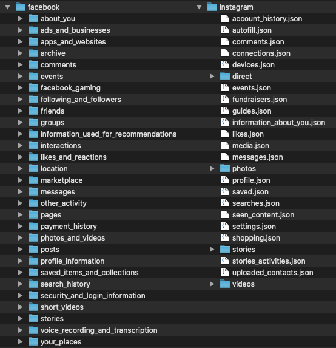

# My Social History

<figure><figcaption>Facebook stats page</figcaption></figure>

>A quick look into your history on social media. Drop in the archives you've downloaded from Facebook and Instagram and see some stats about your time on the networks.

## How to use

This is a small and unpolished Laravel app.

1. Clone this repo to your machine
2. Run `composer install` and afterwards `npm install && npm run production` to download the needed dependencies and compile the minimal included assets.
3. Download your data archives (json format) from [Facebook](https://www.facebook.com/help/1701730696756992?helpref=hc_global_nav) and [Instagram](https://www.facebook.com/help/instagram/181231772500920?helpref=uf_permalink).
4. Create a `facebook` and `instagram` directory unter `storage/app/social-archives` and unzip the contents of the data archives into the corresponding folder.
5. Run `php artisan serve` to run the webapp and head to the displayed URL. You should be able to see your basic stats ✨

<figure><figcaption>How your social-archives directory should look.</figcaption></figure>

## Further usage and development
Feel free to copy, modify, extend or use in any way.
Might break in the future if Facebook or Instagram change their exports.

Aaron